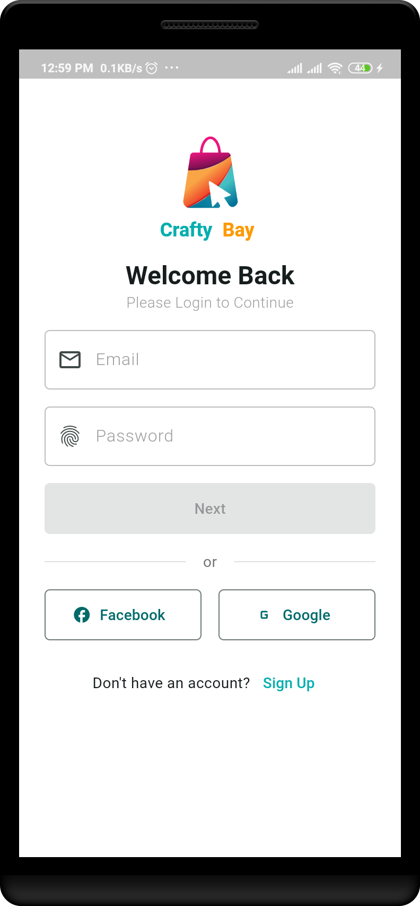
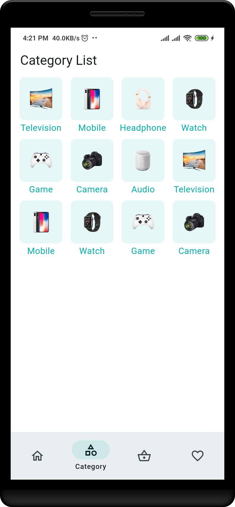

# E-commerce BLoC Flutter App

This is a sample **E-commerce** Flutter application built using the **BLoC** architecture. The app demonstrates the use of various Flutter features, including state management, secure storage, and local database (Drift).

---

## Features

- **Authentication**: Login and Signup functionalities with secure token storage.
- **Product Listing**: Displays products from a remote API and allows users to view detailed information.
- **Shopping Cart**: Manage the shopping cart and interact with products.
- **Local Storage**: Stores user data securely and persists data using Drift database.

---

## Project Setup

### 1. Clone the repository

First, clone this repository to your local machine:

```bash
git clone https://github.com/tamimsoft/E-commerce-BLoC.git
cd E-commerce-BLoC
```

### 2. Install FVM and Set Flutter Version

This project uses **Flutter 3.27.3**. You can manage this version with **FVM (Flutter Version Manager)**.

- Install **FVM** if you haven't already:

  ```bash
  dart pub global activate fvm
  ```

- Install the required Flutter version for the project:

  ```bash
  fvm install 3.27.3
  ```

- Use the specified Flutter version for the project:

  ```bash
  fvm use 3.27.3
  ```

### 3. Install Dependencies

Make sure to install the project dependencies:

```bash
flutter pub get
```

### 4. Run the App

Once all the dependencies are installed and configurations are set, you can run the app using:

```bash
flutter run
```

---

## Project Structure

The project follows the **BLoC pattern** and is organized into the following key folders:

- **core/**: Contains core services like API handling, secure storage, Drift database setup.
- **common/**: Holds reusable widgets and data models.
- **features/**: Contains feature-specific functionality such as Authentication, Home, and Cart.
- **models/**: Shared data models used across the app.

---

## Screenshots

### Login Screen



### Signup Screen


### OTP Screen


### Home Screen


### Category List Screen



### Product List Screen


### Product Details Screen


### Favourite List Screen


### Cart Screen


### Checkout Screen


---

## API Integration

This app fetches product data and interacts with a sample API. You can customize the **API endpoints** in the `ApiService` class under `core/`.

Here is an example of a sample endpoint for fetching products:

```dart
Future<List<ProductModel>> getProducts() async {
  final response = await http.get(Uri.parse('$baseUrl/products'));
  if (response.statusCode == 200) {
    final List<dynamic> json = jsonDecode(response.body);
    return json.map((e) => ProductModel.fromJson(e)).toList();
  } else {
    throw Exception('Failed to load products');
  }
}
```

Make sure to replace the `baseUrl` with your actual API base URL.

---

## Database Integration (Drift)

For local data persistence, the app uses **Drift** (formerly known as `moor`). You can find the Drift setup in `core/database/` and customize it according to your requirements.

### Example: Creating a table

```dart
class Products extends Table {
  IntColumn get id => integer().autoIncrement()();
  TextColumn get name => text().withLength(min: 1, max: 50)();
  RealColumn get price => real()();
  TextColumn get imageUrl => text().nullable()();
}
```

---


## License

This project is open-source and available under the [MIT License](LICENSE).

